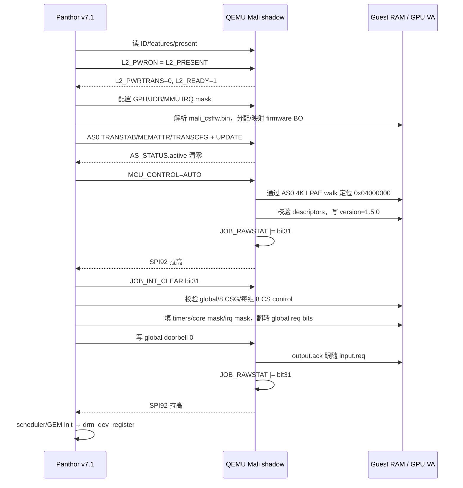
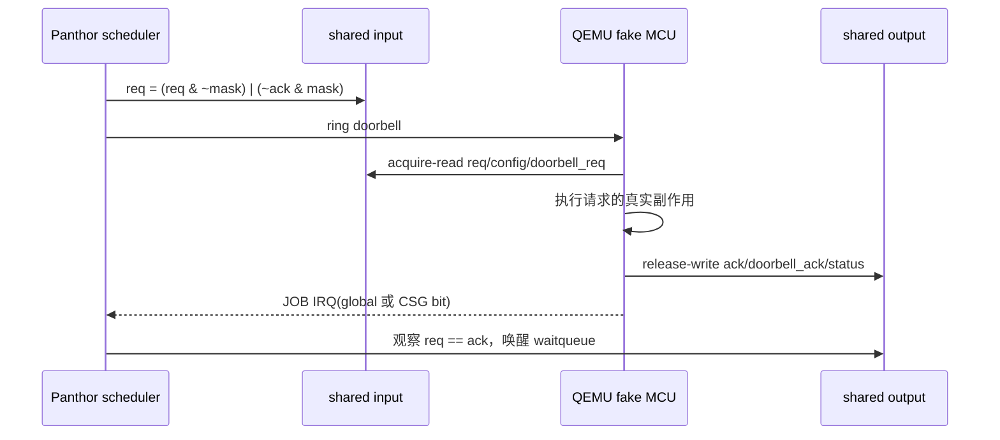

# RK3588 Mali-G610 CSF 在 QEMU 中的行为仿真：可行性与实施裁决

日期：2026-08-29  
研究基线：Linux `v7.1`（本仓库为 `v7.1-20-gd16022aba`，Panthor 相关路径与 `v7.1` 无差异）、Mesa 26.0.3、QEMU 11.1 系列  
目标约束：guest 必须继续看到 RK3588 `gpu@fb000000`，使用真实 Panthor/Mesa/Panfrost/GNOME；不得以 virtio-gpu 或 guest llvmpipe 偷换设备。

## 结论先行

**刀口裁决：选择 B——在 QEMU 里实现 Mali CSF 的 host-side 行为影子；但只批准 M0/M1，M2 设置执行器证据门，当前不承诺 M3。**

- **M0（Panthor 完整 probe、出现 render node）可行**：约 3–6 人周，原型可在 1–3 周内看到 `/dev/dri/renderD128`。它要求的不只是 `GPU_ID`，还包括时钟/供电依赖、GPU/L2/IRQ/MMU、AS0 页表遍历、MCU 启动事件和 CSF 全局接口握手。
- **M1（Mesa 识别为 Panfrost、创建无绘制 EGL context）大概率可行**：M0 后约 1–2 人周。group/queue 的 ioctl 对象创建主要是内核软件状态；只有首次提交才必须调度到 CSG/CS。
- **“假完成”的 M2 仅适合诊断，不算首帧**：QEMU 可以伪造 fence/sync 完成，但 framebuffer 不会因此得到正确像素。
- **正确 M2（首个非 llvmpipe 像素）没有现成后端**：guest Mesa 到设备边界时已经生成 Mali CS 指令和 Valhall shader。`pandecode` 是解码/反汇编器，不是执行器；virgl/Venus/gfxstream 在更高层传 API/IR，无法直接消费 Mali 机器流。窄化到单个 `glClear` 的解释器预计 1–3 人月，覆盖三角形约 3–9 人月；覆盖 GNOME 是 9–24+ 人月级高风险研发。
- **M3（比当前约 79 s 的 guest llvmpipe 首帧更快）在“不改 guest 图形栈”的约束下暂无可信路径**：完整 CPU Valhall/tiler 仿真很可能比 TCG 中的 llvmpipe 更慢。若性能是硬目标，合理的工程刀口是 API/IR 级虚拟化，但那会改用 virtio/相应 guest 驱动，违反本任务宪法。

推荐决策是：**做 SCMI 前置修复 + M0 + M1；随后用一个受控 `glClear`/fence PoC 证明执行后端，再决定是否投入 M2。若 PoC 无法在 4–6 周内写出正确像素，则停止低层仿真路线。**

本文用以下标签区分证据强度：

- **[确证]**：由本仓库 v7.1 源码、固件二进制、真机/仿真日志或上游一手文档直接支持。
- **[推断]**：由已确认接口推导出的实现判断；后附反证办法。
- **[待测]**：必须从真机补采或以 PoC 验证。

## 一、先例考古：已有项目真正复用了什么

### 1.1 上游 QEMU：没有 Mali 功能模型

**[确证]** 本仓库 `third_party/qemu` 的 QEMU 11.1 源码中没有 Mali GPU 设备；`hw/`、`include/`、`docs/` 的 `mali` 搜索只命中格式/文档旁支，历史中也没有可复用的 Mali 提交。当前 `rk3588-lite.c` 对 `0xfb000000` 一带只有空洞/兜底映射，没有 GPU 状态机。

反证命令：

```bash
cd third_party/qemu
git grep -in mali -- hw include docs
git log --all --oneline --grep=mali -- hw include docs
```

QEMU 官方 3D 路线也说明了为什么它帮不上这个刀口：virgl 传 Gallium IR，Venus 传 Vulkan 协议，gfxstream 转发 GLES/Vulkan 调用；这些协议都位于 Mali CS/Valhall 机器流之上。[QEMU VirtIO GPU 文档](https://www.qemu.org/docs/master/system/devices/virtio/virtio-gpu.html)

### 1.2 Mesa `drm-shim`：能骗过设备查询和编译器，不能渲染

**[确证]** Panfrost `drm-shim` 明确支持用 `PAN_GPU_ID=a867` 模拟 Mali-G610，可在无 Mali 的 Intel 主机上跑 shader-db、复现编译器或部分驱动问题；它暴露的是 no-op DRM 接口，不是 GPU 执行器。[Mesa Panfrost drm-shim 文档](https://docs.mesa3d.org/drivers/panfrost/drm-shim.html)

可复用：GPU 属性模型、Mesa 初始化所需最小查询集、shader/data structure dump、`PAN_MESA_DEBUG=trace,dump` 的差分验证方法。

不可复用：job 执行、tiler、纹理、shader core、正确 framebuffer 写回。

### 1.3 VirGL / Venus / gfxstream：证明“高刀口”有效，但协议不兼容

**[确证]** VirGL 把 guest GL 降为 Gallium IR 后交给 host OpenGL；Venus 序列化 Vulkan；gfxstream 转发 GLES/Vulkan 调用。它们成功的共同原因，是在语义尚未坍缩成厂商机器指令之前截获工作。[Mesa VirGL](https://docs.mesa3d.org/drivers/virgl.html)、[Mesa Venus](https://docs.mesa3d.org/drivers/venus.html)、[AOSP gfxstream](https://android.googlesource.com/platform/hardware/google/gfxstream/)

**[推断]** 不存在把任意 Valhall command stream 稳定“逆编译回 GL/Vulkan”的短路径；descriptor、同步、内存别名、shader 二进制和 tiler 副作用都已编码在设备 ABI 中。

反证办法：找出一个现有、可构建的软件组件，输入 Panfrost v10 CS + Valhall binary + GPU VA 空间，输出与 G610 一致的内存副作用。只会反汇编、trace 或需要实体 Mali DRM 的组件不满足条件。

### 1.4 Panfrost native context / Arm arbitration：需要真实 Mali

**[确证]** QEMU 文档已列出 Panfrost DRM native context，但它是 virtio-gpu/virglrenderer 的 host DRM 转发能力，host 仍需能运行相应内核/Mesa 栈；它不是 x86 软件 G610。[QEMU VirtIO GPU 文档](https://www.qemu.org/docs/master/system/devices/virtio/virtio-gpu.html)

Arm 的 Mali GPU Arbitration Reference Code 面向 Xen 前后端共享实体 GPU，也不是功能仿真器。[Arm Mali GPU Arbitration Reference Code](https://developer.arm.com/downloads/-/Mali%20GPUs%20Arbitration%20Reference%20Code)

### 1.5 Asahi AGX：方法论先例，而非代码后端

**[确证]** AGX 同样由协处理器固件、共享内存、doorbell、GPU 页表、work queue 和 completion event 组成；Asahi 的文档还明确区分 firmware/kernel interface 与真正的 shader/tiler 用户态工作。[Asahi AGX 文档](https://asahilinux.org/docs/hw/soc/agx/)

可复用的方法是：

1. 在真机 hypervisor/trace 中记录 MMIO、共享内存和中断；
2. 单变量变异请求，观察 ACK 与内存副作用；
3. 把协议对象化，而不是堆积“读某偏移返回常量”；
4. 用真实驱动作 oracle，逐步扩大行为覆盖。

不可复用的是 AGX 执行后端或协议本身；AGX 和 Mali CSF 不是同一 ISA/固件 ABI。

### 1.6 Renode：未找到所谓 Mali-200/470 模型

**[确证，范围有限]** 截至本文日期，在 Renode 官方仓库当前树、历史和文档中没有找到 Mali-200/Mali-470 功能模型。不能把其他 framebuffer 或 PolarFire 的 Mustein GPU 支持误认为 Mali。

反证办法：在指定 Renode commit 上提供模型路径和测试；或运行：

```bash
git grep -inE 'mali[-_ ]?(200|400|450|470)|arm.*mali'
git log --all -S'Mali-470' --oneline
```

因此，本项目没有可直接移植的开源 Mali 模型；最接近的现成资产是 Panthor 源码、Panfrost decoder 和真机 oracle。

## 二、v7.1 精确接口规格

本节以本仓库 [Panthor 寄存器定义](../../third_party/src/rk3588-topeet/linux/drivers/gpu/drm/panthor/panthor_regs.h)、[固件接口结构](../../third_party/src/rk3588-topeet/linux/drivers/gpu/drm/panthor/panthor_fw.h) 和 [固件握手实现](../../third_party/src/rk3588-topeet/linux/drivers/gpu/drm/panthor/panthor_fw.c) 为准。上游 Tyr 对 CSF MCU、group、queue、shared input/output/control 的说明与该模型一致。[Collabora Tyr CSF 架构说明](https://www.collabora.com/news-and-blog/blog/2026/05/14/building-tyr-in-rust-csf-architecture-and-booting-the-mcu/)

### 2.1 probe 的真实前置顺序

**[确证]** v7.1 `panthor_device_init()` 的顺序是：

```text
clock get
  → power-domain attach
  → OPP/regulator/devfreq
  → MMIO map
  → runtime-PM resume（启用 core/stacks/coregroup clocks）
  → GPU HW/IRQ + L2
  → coherency
  → MMU/IRQ
  → firmware parse/load + AS0 + MCU boot
  → scheduler（校验 CSG/CS 数量）
  → GEM
  → drm_dev_register
```

所以只返回 `GPU_ID` 不会得到 render node；`drm_dev_register()` 在 firmware 和 scheduler 之后。

### 2.2 当前仿真的第零阻塞：SCMI，随后可能是 PMIC/regulator

**[确证]** 当前 `smoke.py board --check` 的日志 `/tmp/sim-rk3588-lite-board-boot.log` 中，SCMI SMC transport 在约 4.02 s 进入 `shmem_tx_prepare` 后超时，报 `unable to communicate` / probe `-95`；日志中没有任何 Panthor 行。GPU DT 的 `assigned-clocks` 又引用 `scmi_clk SCMI_CLK_GPU`，因此当前设备甚至未走到 `panthor_probe()`。

**[推断]** 修好 SCMI 后，板级 `mali-supply` 所指 PMIC regulator 还可能成为下一次 `-EPROBE_DEFER`；Panthor devfreq 会调用 OPP/regulator API，而当前仿真日志存在 PMIC 失败。不能把“SCMI 修好”误写成“M0 已通”。

反证/定位命令：

```bash
dmesg | grep -E 'arm-scmi|fb000000|panthor|regulator|rk806'
cat /sys/kernel/debug/devices_deferred | grep -E 'fb000000|gpu'
cat /sys/kernel/debug/device_component/* 2>/dev/null | grep fb000000
```

最终方案应给 QEMU 增加最小且一致的 SCMI clock server/SMC+shared-memory 行为，并使 PMIC regulator/OPP 可用。临时删除仿真 DT 的 `assigned-clocks` 或 `mali-supply` 只能作为 A/B 诊断，不应成为宣称“RK3588 真设备模型”的最终补丁。

### 2.3 真机常量与尚缺采样项

**[确证]** [2026-08-15 真机日志](../logs/rk3588/202608152149.txt) 给出：

| 字段 | 值 | 证据/解释 |
|---|---:|---|
| core clock | `328000000` Hz | 真机日志 |
| `GPU_ID` | `0xa8670005` | 日志打印 product `0xa867`、version `0.0`、status `5`，按 v7.1 位域还原 |
| `GPU_L2_FEATURES` | `0x07120306` | 真机日志 |
| `GPU_TILER_FEATURES` | `0x00000809` | 真机日志 |
| `GPU_MEM_FEATURES` | `0x00000301` | 真机日志 |
| `GPU_MMU_FEATURES` | `0x00002830` | VA=48 bit、PA=40 bit |
| `GPU_AS_PRESENT` | `0x000000ff` | AS0–AS7 |
| `GPU_SHADER_PRESENT` | `0x00050005` | 真机日志 |
| `GPU_TILER_PRESENT` | `0x1` | 真机日志 |
| `GPU_L2_PRESENT` | `0x1` | 真机日志 |
| firmware SHA | `95a25d71030715381f33105394285e1dcc860a65` | 真机日志 |
| CSF interface | `1.5.0` | features `0`, instrumentation `0x71` |
| DRM | Panthor `1.8.0`, minor 1 | 真机日志 |

**[待测]** `CORE_FEATURES`、`CSF_ID`、`GPU_FEATURES`、thread/texture feature、`GPU_REVID`、coherency feature 的真机原始值未出现在现有日志中。M0 可以先采用驱动能接受的保守值，M1 前必须用临时 Panthor debug patch 或 `/dev/mem` 安全采集并固化 fixture。

反证标准：同一内核从真机读取的原始寄存器与表中值不一致时，以原始 dump 为准；尤其不要把 Mesa 的 model table 当硬件读数。

### 2.4 最小寄存器合同

下表是 v7.1 必须实现或显式记录的范围。`RO`/`RW`/`W1C` 是 guest 视角；所有 `*_STAT` 均为 `RAWSTAT & MASK`，只要 STAT 非零就保持对应 level IRQ。

| 偏移 | 寄存器 | M | 最小行为 |
|---:|---|---|---|
| `0x000` | `GPU_ID` | M0 | RO，`0xa8670005` |
| `0x004..0x01c` | L2/core/tiler/mem/MMU/AS/CSF features | M0/M1 | RO；采用真机值，未知值先保守且留 fixture |
| `0x020/24/28/2c` | GPU IRQ raw/clear/mask/stat | M0 | mask RW、clear W1C、stat 派生，驱动使用 SPI 94 |
| `0x030` | `GPU_CMD` | M0 | soft/hard reset 产生 bit 8；cache flush 产生 bit 17 |
| `0x034..0x048` | status/fault/L2 config | M0 | 无故障时 idle；保存 L2 config；故障注入时给 status/address |
| `0x060` | `GPU_FEATURES` | M1 | 64-bit RO；G610 无证据前返回 0，真机 dump 后校正 |
| `0x088/90/98` | timestamp offset/cycle/timestamp | M1/M2 | 单调 64-bit；offset RW 或按驱动语义保存 |
| `0x0a0..0x0bc` | thread/texture features | M1 | 必须与 G610 Mesa model 相容；最终用真机 fixture |
| `0x100/110/120` | shader/tiler/L2 present | M0 | RO：`0x50005/1/1` |
| `0x140/150/160` | shader/tiler/L2 ready | M0 | 上电后与 present 相符；M0 至少 `L2_READY=1` |
| `0x180..0x220` | power on/off/transition | M0 | 写 PWRON/PWROFF 同步更新 ready，transition 最终为 0 |
| `0x240..0x260` | power active | M0/M2 | M0 可与 ready 同步；执行时反映 active |
| `0x280` | `GPU_REVID` | M1 | RO，待真机采样 |
| `0x2c0...` | ASN hash | M1 | RW 保存；仅按实际读取范围实现 |
| `0x300/304` | coherency features/protocol | M0 | feature 待采；保存 driver 选择的 protocol |
| `0x700/704` | MCU control/status | M0 | `AUTO` → boot work item；status disabled/enabled/fatal |
| `0x1000/04/08/0c` | JOB IRQ | M0 | bit31=global，bit0..30=CSG，SPI 92，W1C/level |
| `0x2000/04/08/0c` | MMU IRQ | M0 | fault bits，SPI 93；正常路径不主动触发 |
| `0x2400+n*0x40` | AS0–AS7 | M0/M2 | 64-bit transtabs/memattr/transcfg；command/status/fault；M0 必须支持 AS0 4K LPAE walk |
| `0x10000` | latest flush ID | M1/M2 | guest 可 mmap 的只读页；随 flush/提交一致推进 |
| `0x80000+n*0x10000` | CSF doorbell | M0/M2 | `n=0` global；CSG queue 使用后续 ID；写 1 调度 BH/Aio work |

实现注意：MMIO 区按 DT 2 MiB 暴露；64-bit 寄存器必须允许驱动的 low/high 访问顺序；未知偏移以 trace-once 返回 0，不能静默吞掉所有访问。

### 2.5 固件镜像给出的捷径

**[确证]** 仓库 `mali_csffw.bin` 大小 282624 byte，头部 magic `0xc3f13a6e`、格式 `0.3`、header size `0x318`。其共享 section 映射到 GPU VA `0x04000000–0x04010000`，文件初值已包含控制面布局：

| 对象 | control/input/output GPU VA | 数量/步长 |
|---|---|---|
| Global | `0x04000000` / `0x04200000` / `0x04600000` | CSG `8`，stride `0xa0` |
| CSG0 | `0x04001000` / `0x04300000` / `0x04700000` | CS `8`，stride `0x0c` |
| CS0 | control 从 `0x04001040` 起 | input `0x04340000`，output `0x04720000`；其余按描述符遍历 |

初始 global `version=0`、features `0`、instrumentation `0x71`；CSG/CS descriptor 已就位。

**[推断]** M0 的 fake MCU 不需要构造整个接口，只需：从 AS0 页表找到共享 VA，校验 descriptor，写 `version=0x01050000`，置 `MCU_STATUS_ENABLED`，触发 `JOB_INT_GLOBAL_IF`。这比 rehost 闭源 Cortex-M7 固件小得多。

反证办法：在 QEMU 中对共享 section 做只读 hash/布局日志；若 guest loader 重定位后 VA 或 descriptor 与这里不同，按运行时 section table 解析，禁止硬编码 host physical address。

### 2.6 从 probe 到 firmware boot 的握手



boot IRQ 等待上限约 1 s。fake MCU 的内存修改应放在 QEMU bottom half/Aio context 中完成，并在置 RAWSTAT/拉 IRQ 前保证 guest RAM 写入可见；不要在 MMIO write callback 中递归执行完整队列。

### 2.7 toggle/ACK 合同

**[确证]** CSF 不是“写命令、返回成功”，而是 toggle protocol：某请求位在 `input.req != output.ack` 时 pending；firmware 处理完，把对应 ACK 位追平，再根据 `ack_irq_mask` 触发 JOB IRQ。

Global：

- 处理 `CFG_PROGRESS_TIMER`、`CFG_ALLOC_EN`、`CFG_POWEROFF_TIMER`、`COUNTER_EN`、`PING`、`IDLE_EN` 等；M0/M1 至少要 ACK 初始化位和周期性 watchdog `PING`。
- `doorbell_req/ack` 同样要追平。
- global event 触发 `JOB_INT_GLOBAL_IF`。

CSG：

- `STATE`：`TERMINATE=0`、`START=1`、`SUSPEND=2`、`RESUME=3`。
- ACK `ENDPOINT_CONFIG`、`STATUS_UPDATE`，复制 doorbell req→ack。
- `cs_irq_req` 与 host 写入的 `cs_irq_ack` 形成 CS event 通道。
- CSG event 触发 `JOB_INT_CSG_IF(slot)`。

CS：

- `STATE`：`STOP=0`、`START=1`。
- 输入包含 ring base/size、ring input/output VA、heap、doorbell ID；输出包含 ACK、command pointer、wait/fault/fatal/heap 状态。
- M1 可 ACK start/stop 而不消费用户 command stream；M2 必须按 ring insert/extract 执行并正确更新 sync memory，不能仅移动 extract 指针。



## 三、实施架构与 M0–M3

### 3.1 QEMU 设备分层

建议新建独立设备（名称示意 `rk3588-mali-csf-shadow`），由 `rk3588-lite` 实例化：

```text
MMIO register bank + three level IRQs
  ├─ ID / feature fixture
  ├─ power / reset / cache state
  ├─ AS0..7 + 4K LPAE GPU page walker
  ├─ firmware shared-interface engine
  │    ├─ global request/ACK
  │    ├─ CSG lifecycle
  │    └─ CS lifecycle/ring dispatcher
  └─ optional execution backend
       ├─ no-op/fence diagnostic backend
       └─ future Valhall/tiler interpreter
```

设计约束：

- 通过 QEMU `AddressSpace` 访问 guest physical RAM；GPU VA 必须经过 AS 页表，不能把 guest VA 当 GPA。
- 从 firmware section/descriptor 发现控制区，避免硬编码 BO 的 GPA。
- IRQ 使用统一 `raw/mask/stat/update_irq()` helper，qtest 覆盖 W1C、mask 后拉低、level 重入。
- 从第一天加入 VMState：寄存器、AS、MCU/IRQ、CSG/CS lifecycle、pending work 均可迁移/快照。
- 提供 `-trace rk3588_mali_*` 事件和限频 unknown-register 日志；真机 trace 与 QEMU trace 可归一化 diff。
- fault injection 是模型的一部分：非法 PTE、未映射 VA、错误 interface descriptor 应产生可解释的 MMU/firmware error，而不是 host 崩溃。

### 3.2 M-pre0：解除平台依赖

范围：最小 SCMI clock server/SMC shared-memory 行为，GPU clock ID 5 的 describe/rate get/set/enable；确认 PMIC regulator、OPP 和 GPU power domain 不再 defer。

工期：2–5 天做针对性 stub；若要通用且可上游的 SCMI 模型，1–2 周。风险：中。

验收：

```bash
python3 boards/rk3588-topeet/sim/smoke.py board --check
grep -E 'arm-scmi|panthor|fb000000|regulator' /tmp/sim-rk3588-lite-board-boot.log
# guest 内：
cat /sys/kernel/debug/devices_deferred | grep -E 'fb000000|gpu' && exit 1 || true
```

通过标准：SCMI 不再超时；GPU 不在 deferred list；日志至少进入 Panthor 并读到 `GPU_ID`。若仍无 probe，先修 supplier，不开始 GPU 协议编码。

### 3.3 M0：真实 Panthor probe 与 render node

范围：表 2.4 的 M0 项、AS0 page walker、firmware boot/global ACK、8×8 descriptor 校验、watchdog ping、reset/cache/L2、三路 IRQ。

预计：原型 1–3 周，qtest/错误路径/快照硬化到 3–6 人周。风险：中高，主要在页表语义、内存顺序和隐藏的 suspend/reset 路径。

验收：

```bash
dmesg | grep -E 'Mali-G610|CSF FW using interface|Initialized panthor'
test -c /dev/dri/renderD128
udevadm info -q property /dev/dri/renderD128 | grep -E 'DRIVER=panthor|DEVNAME='
cat /sys/kernel/debug/dri/1/state 2>/dev/null || true
```

必须同时出现 G610、CSF 1.5.0 和 Panthor 初始化；单有字符设备、手工 mknod 或跳过 firmware init 不算。

M0 qtest 最小集：

```text
id-and-feature-fixture
gpu-job-mmu-irq-mask-w1c-level
l2-power-on-off
gpu-reset-and-cache-complete
as0-4k-walk-valid-and-fault
firmware-boot-version-and-global-irq
global-ping-toggle-ack
snapshot-restore-idle-and-pending-irq
```

### 3.4 M1：Mesa 真识别与空上下文

范围：补齐 query feature/timestamp/latest-flush，允许 VM/BO/group/queue ioctl 正常创建和销毁；CSG/CS 可完成 start/stop/suspend/resume，但测试不得提交绘制。

预计：M0 后 1–2 周。风险：中。

验收：

```bash
EGL_PLATFORM=surfaceless MESA_LOADER_DRIVER_OVERRIDE=panfrost eglinfo -B 2>&1 | tee /tmp/eglinfo-panfrost.txt
grep -Ei 'Panfrost|Mali-G610' /tmp/eglinfo-panfrost.txt
! grep -Eqi 'llvmpipe|softpipe' /tmp/eglinfo-panfrost.txt
```

另写一个 50–100 行 EGL smoke：只 `eglGetDisplay`、initialize、choose config、create pbuffer/context、make current、destroy；禁止 `glClear`/swap。以 `strace -e ioctl` 和 QEMU trace 确认走的是 `/dev/dri/renderD128`、Panthor ioctl，而非 shim/llvmpipe。

### 3.5 M2a：no-op submission（只作量具）

范围：解析内核 wrapper ring 的控制流，至少识别 `MOV32 latest_flush`、`FLUSH`、`WAIT`、`CALL`、`SYNC_ADD64`、`ERROR_BARRIER`；可选择跳过 CALL 的用户 stream，然后更新 completion sync 和 extract。

预计：1–2 周。风险：中。它能验证调度、doorbell、fence、hang recovery，但 **验收名称必须是 `M2a-noop`，不得称渲染成功**。

反证测试：清屏前把目标 BO 填充随机色；若 fence 完成但目标像素未成为指定 clear color，即证明只是 fake completion。

### 3.6 M2b：第一个正确非 llvmpipe frame

范围至少包括：

1. CS 指令解释、CALL/WAIT/sync/barrier；
2. Mali descriptors、resource tables 和 framebuffer/tiler heap；
3. Valhall shader ISA 执行；
4. vertex/fragment/tiler、tile store/load；
5. 常用 format、blend、depth/stencil、texture/sample；
6. cache/MMU/fault 与并发可见性。

**[推断]** 可先限定为单 render target、无 MSAA/纹理/depth 的 `glClear`，约 1–3 人月；随后限定三角形约 3–9 人月。`kmscube` 已比单三角形复杂，GNOME/Mutter 覆盖是 9–24+ 人月且方差极大。

反证办法：若找到能直接执行本项目 trace 中 CS/Valhall 流的现成自由软件后端，则重新估时；否则不得以 decoder 代码量外推 executor 工期。

首帧验收：

```bash
# 先跑固定尺寸、固定 clear color/triangle 的自有 GLES 测试
PAN_MESA_DEBUG=trace MESA_LOADER_DRIVER_OVERRIDE=panfrost ./gles-clear-readback
# 程序必须 glReadPixels 并校验至少 16 个预定采样点及整帧 hash

# 再跑显示路径
kmscube -D /dev/dri/card0
```

通过条件：renderer 是 Panfrost/G610、无 llvmpipe；readback hash 与真机 oracle 相符；QEMU trace 显示至少一条真实用户 CS 被执行；仅 fence、黑屏、静态旧帧均失败。

### 3.7 M3：GNOME 与性能

当前判定：**No-Go，等待 M2b 执行器 PoC 后复审。**

原因不是 QEMU 外壳，而是执行覆盖和性能：GNOME/Mutter 会触及持续 shader 编译、texture/blend、多个 surface、同步、modifier、damage、reset 和电源管理。纯 CPU 解释 Valhall/tiler 的每条底层操作，可能比在 guest TCG 中跑高度优化的 llvmpipe 更差。

若 M2b 通过，M3 验收建议固定：

```text
同一 rootfs、分辨率、CPU 数、QEMU build 和冷/热缓存条件
5 次从 display-manager start 到第一张稳定桌面截图
报告 median/p95；目标 median < 79 s
renderer 字符串不得含 llvmpipe/softpipe
截图做 perceptual hash + 关键区域像素检查
连续运行 30 min，无 GPU reset/watchdog/fault
```

## 四、host 执行后端裁决

| 候选 | 能否保持真实 guest Panthor | 能否消费 Mali CS/Valhall | x86 host 可用 | 裁决 |
|---|---:|---:|---:|---|
| `pandecode`/Mesa trace | 是 | 只解码，不执行 | 是 | 作为 oracle/调试器 |
| Mesa Panfrost host driver | 表面可 | 生成/提交，不软件执行 | 无实体 Mali 时否 | 不可作为 x86 backend |
| Panfrost DRM native context | 否（通常是 virtio guest 协议） | 转发给实体 Mali | 通常否 | 架构参考 |
| virgl | 否 | Gallium IR，不收 Mali 流 | 是 | 性能路线，但违反约束 |
| Venus/gfxstream | 否 | Vulkan/GLES 协议，不收 Mali 流 | 是 | 同上 |
| SwiftShader/llvmpipe host | 只有先恢复高层 API/IR 才能接 | 否 | 是 | 不能直接接设备边界 |
| 自研 CS+Valhall+tiler interpreter | 是 | 目标就是能 | 是 | 唯一纯软件低刀口路线，成本最高 |
| 重宿主闭源 CSF MCU 固件 | 是 | MCU 只调度，GPU core 仍缺 | 理论可 | M0 不划算，M2 仍无执行器 |

**为何不选“直接跑闭源 MCU”作为刀口 A：** 即便 QEMU 能跑 Cortex-M7，固件还依赖未公开的 boot/memory map、timer、power/cache 和 GPU 内部寄存器；把这些补齐已接近重建 GPU 控制面，而且 MCU 本身不执行 Valhall shader。行为影子能更快通过 M0/M1，却不会掩盖 M2 的真正缺口。

## 五、风险账本

| 风险 | 概率/影响 | 最早信号 | 缓解/止损 |
|---|---|---|---|
| SCMI supplier 阻断 probe | 已发生/高 | SCMI `-95`，无 Panthor 行 | M-pre0 独立交付；deferred list 清零后才进 M0 |
| PMIC regulator/OPP 再 defer | 高/中 | `mali-supply`、OPP 返回 `-EPROBE_DEFER` | 完成 regulator fixture；DT 删除只做 A/B |
| 特征寄存器猜错 | 中/中 | Mesa capability 异常或拒绝设备 | 真机原始 dump，保存 machine-readable fixture |
| 64-bit MMIO/页表语义错 | 中/高 | firmware VA 找不到、随机 fault | 单测 low/high 顺序；页 walker 与 guest 页表 dump 差分 |
| IRQ 边沿代替电平 | 中/高 | 丢中断、boot 偶发超时、IRQ storm | `stat=raw&mask`；qtest 覆盖 mask/W1C/reassert |
| ACK 太积极掩盖缺副作用 | 高/高 | ioctl 成功但像素不变 | 每个 ACK 绑定副作用断言；M2a 与 M2b 分名 |
| watchdog/power/reset 未覆盖 | 高/高 | 5 s 后 reset、autosuspend 后死 | 从 M0 实现 ping、suspend/resume、reset；加长稳测 |
| host OOB/恶意 PTE | 中/高 | guest 输入导致 QEMU crash | 所有 GPA/长度溢出检查；页 walk 层级/权限/循环上限 |
| 快照恢复丢 pending job/IRQ | 中/中 | restore 后 hang | 从 M0 维护 VMState；pending BH 可重建 |
| Valhall ISA 文档/覆盖不足 | 高/致命 | 首个 CALL 后无法产生像素 | 4–6 周 executor gate；失败即停止 M2 投资 |
| 性能反而低于 llvmpipe | 高/高 | clear/triangle 已极慢 | 先测每阶段成本；不以增加线程掩盖架构问题 |
| 真机 oracle 不可重复 | 中/中 | trace 随频率/地址漂移 | 归一化地址/时间；固定 workload；记录固件 SHA |

安全边界：device DMA 访问完全受 guest 控制，页表和 ring 中的所有地址都必须视为不可信输入；QEMU 设备模型不能直接解引用 guest 指针。

## 六、开放问题与下一轮最小实验

按优先级排列：

1. **SCMI/PMIC 到底各自贡献了多少 defer？** 在 guest 采集 `devices_deferred`，再分别做仅 SCMI、仅 regulator 的 A/B overlay。
2. **缺失 feature 原始值是什么？** 给 v7.1 加一次性 debug dump，真机采 `0x008/0x01c/0x060/0x0a0..0xbc/0x280/0x300`。
3. **firmware runtime layout 是否永远与镜像初值一致？** 记录 section table、AS0 PTE 和 shared 64 KiB；跨 10 次启动比较归一化 hash。
4. **M1 的最小 ioctl 边界？** 用无 draw EGL smoke + `strace` 列出精确 Panthor ioctl 序列，并确认何时第一次 CSG START。
5. **第一个 draw 的 wrapper/user stream 是什么？** 对固定 `glClear` 开 `PAN_MESA_DEBUG=trace,dump`，同时在 QEMU 记录 GPU VA translation 和 ring bytes，与真机 dump 对齐。
6. **是否存在可复用 Valhall executor？** 只接受能运行上述捕获流并产生相同内存副作用的 PoC；decoder、compiler、实体 GPU passthrough 均不算。
7. **成功指标到底偏兼容还是偏性能？** 若 79 s 是硬门槛，应尽早申请修改宪法，转向 virgl/Venus/gfxstream；否则按研究项目接受低速正确性优先。

建议立即执行的 10 个工作日切片：

```text
Day 1–2   deferred-device + 真机 feature/firmware/MMIO fixture
Day 3–5   最小 SCMI clock + regulator/OPP 通路
Day 6–7   Mali MMIO skeleton、ID/power/IRQ qtests
Day 8–9   AS0 4K LPAE walker + valid/fault qtests
Day 10    MCU boot：写 version 1.5.0 + global IRQ，记录下一阻塞
```

第 10 天的 go/no-go 证据不是 render node，而是可重复看到：Panthor 已过平台依赖、读到真实 ID、L2 ready、AS0 能翻译 shared VA、MCU boot IRQ 被 driver 收到。之后再进入 global ACK/scheduler 的 M0 收尾。

## 七、最终建议

这条路线值得做，但要把它定义为 **“真实 Panthor 控制面仿真 + 有门槛的 GPU 执行研究”**，而不是“给几个寄存器填值就能让 GNOME 加速”。

- 现在批准 M-pre0、M0、M1：它们能产出可测试、可复用的 RK3588/QEMU 设备模型，也能让真实 Panthor/Mesa 初始化。
- M2a 仅作为调度量具，产物和里程碑名称必须明确写 no-op。
- M2b 以正确 `glClear` readback 为执行器证据门；4–6 周仍无正确像素则 No-Go。
- M3 不排期。若最终目标是“比 79 s 更快地进 GNOME”，应把约束讨论提升到架构层：接受 virtio/API-IR 虚拟化，或提供实体 Mali 后端；否则性能目标与低层行为仿真的成本模型相冲突。

这既保留了“guest 使用真实 Panthor”的技术价值，也避免用虚假的 fence 成功掩盖最难、最贵、且目前没有现成后端的那一半工程。
